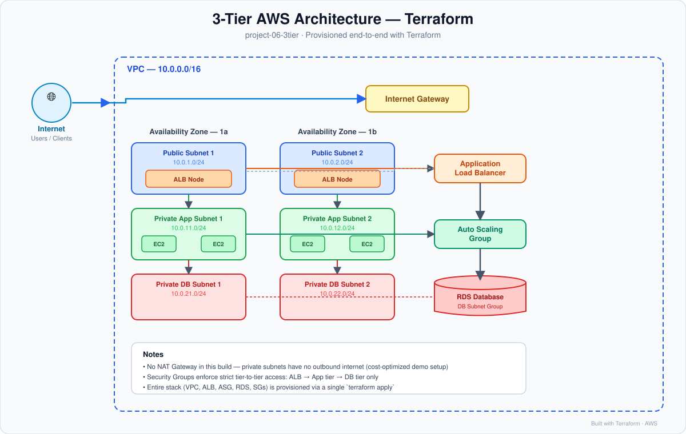
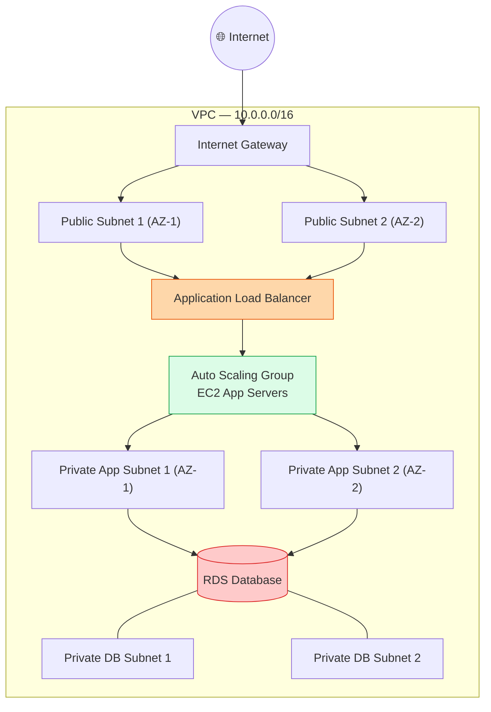
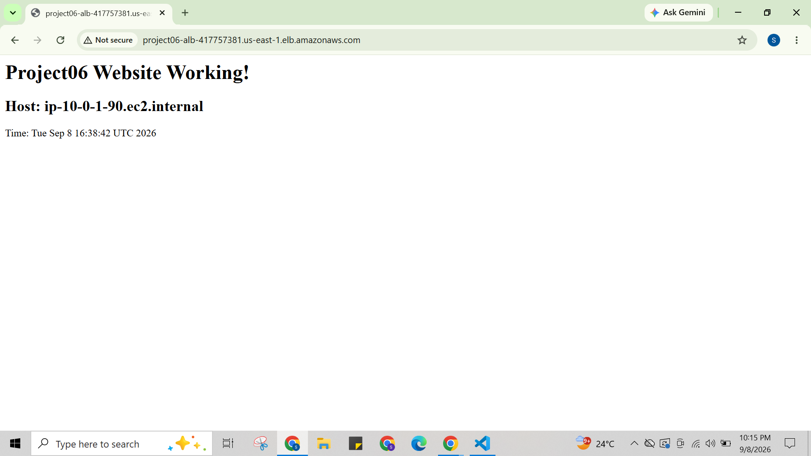

# 🏗️ Project 6: Terraform 3-Tier AWS VPC (Infrastructure as Code)

[](https://www.terraform.io/)
[](https://aws.amazon.com/)

> Fully automated, production-style **3-Tier Architecture** on AWS — provisioned end-to-end with Terraform. This is the Infrastructure-as-Code version of the VPC originally built manually via the AWS Console.

---

## 📌 Overview

This project provisions a complete 3-tier AWS environment with a single command — `terraform apply`. No manual clicking in the AWS Console. Networking, compute, load balancing, and database are all defined as code, version-controlled, and repeatable.

**What gets built:**
- Custom **VPC** with 2 public + 2 private (app) + 2 private (DB) subnets across 2 Availability Zones
- **Internet Gateway** for public internet access
- **Application Load Balancer (ALB)** in the public subnets, routing traffic to the app tier
- **Auto Scaling Group (ASG)** of EC2 instances in the private subnets (application tier), bootstrapped via `userdata.sh`
- **RDS** database in an isolated private subnet (database tier)
- **Security Groups** enforcing least-privilege, tier-to-tier access (ALB → App → DB)

> ℹ️ **Note:** This build does **not** provision a NAT Gateway (to keep it cost-optimized for a demo/learning environment). As a result, the private app-tier instances have **no outbound internet access** — they're reached only via the ALB and communicate only with the DB tier. If you need outbound internet from private subnets (e.g. for OS package updates), add a NAT Gateway + private route table entry.

---

## 🖼️ Architecture Diagram



**Traffic flow:** `User → Internet Gateway → ALB (public subnets) → EC2 / ASG (private app subnets) → RDS (private DB subnets)`

<details>
<summary>📎 Mermaid version (renders natively on GitHub too)</summary>


</details>

---

## 🧰 Tech Stack

| Category | Tool/Service |
|---|---|
| IaC Tool | Terraform |
| Cloud Provider | AWS |
| Networking | VPC, Public/Private Subnets, Internet Gateway, Route Tables |
| Compute | EC2, Auto Scaling Group, Launch Template, `userdata.sh` bootstrap |
| Load Balancing | Application Load Balancer (ALB) + Target Groups |
| Database | Amazon RDS |
| Security | Security Groups (tier-isolated) |

---

## 📂 Project Structure

```
project-06-3tier/
├── main.tf                     # Root config — provider, VPC/resource wiring
├── vpc.tf                      # VPC, subnets (public/private), route tables, IGW
├── sg.tf                       # Security Groups (ALB / App / DB tiers)
├── alb.tf                      # Application Load Balancer + Target Group + Listener
├── asg.tf                      # Launch Template + Auto Scaling Group
├── rds.tf                      # RDS instance + DB subnet group
├── userdata.sh                 # EC2 bootstrap script (installs & starts app)
├── output.tf                   # Output values (ALB DNS, RDS endpoint, etc.)
├── architecture-diagram.svg    # Architecture diagram used in this README
├── LICENSE
├── .gitignore
├── .terraform.lock.hcl
└── README.md
```

> ⚠️ `terraform.tfstate` / `terraform.tfstate.backup` and the `.terraform/` folder are **not** committed — they're excluded via `.gitignore` since they contain sensitive resource state. Never push state files with real credentials to a public repo.

---

## ✅ Prerequisites

- [Terraform](https://developer.hashicorp.com/terraform/downloads) >= 1.6
- [AWS CLI](https://docs.aws.amazon.com/cli/latest/userguide/getting-started-install.html) configured with valid credentials (`aws configure`)
- An AWS account with permissions to create VPC, EC2, ALB, ASG, and RDS resources
- An existing EC2 Key Pair (if you plan to SSH into instances via a bastion)

---

## ⚙️ Configuration

Update variables directly in `main.tf` / create your own `terraform.tfvars`, for example:

```hcl
aws_region        = "us-east-1"
vpc_cidr          = "10.0.0.0/16"

public_subnets       = ["10.0.1.0/24", "10.0.2.0/24"]
private_app_subnets  = ["10.0.11.0/24", "10.0.12.0/24"]
private_db_subnets   = ["10.0.21.0/24", "10.0.22.0/24"]

instance_type     = "t3.micro"
min_size          = 2
max_size          = 4
desired_capacity  = 2

db_engine         = "mysql"
db_instance_class = "db.t3.micro"
db_name           = "appdb"
db_username       = "admin"
db_password       = "CHANGE_ME"   # pass via TF_VAR_db_password env var instead
```

> ⚠️ **Never commit real secrets.** Pass `db_password` via the `TF_VAR_db_password` environment variable rather than hardcoding it.

---

## 🚀 Usage

```bash
# 1. Initialize Terraform (downloads providers)
terraform init

# 2. Preview the execution plan
terraform plan

# 3. Apply — this provisions everything on AWS
terraform apply

# 4. Destroy everything when you're done (avoid surprise billing!)
terraform destroy
```

---

## 📤 Outputs

After a successful `apply`, Terraform prints (see `output.tf`):

| Output | Description |
|---|---|
| `alb_dns_name` | Public DNS of the Load Balancer — hit this in your browser |
| `vpc_id` | ID of the created VPC |
| `public_subnet_ids` | IDs of the public subnets |
| `private_app_subnet_ids` | IDs of the app-tier private subnets |
| `rds_endpoint` | RDS connection endpoint (used by app servers) |

---

## 🔐 Security Notes

- **App tier (EC2/ASG)** sits in private subnets — no public IPs, no direct internet inbound access.
- **DB tier (RDS)** is in its own isolated private subnets — only reachable from the app tier's security group, on the DB port.
- **ALB** is the only internet-facing component — inbound HTTP/HTTPS only.
- Security Groups are scoped tier-to-tier (ALB → App → DB), never open to `0.0.0.0/0` beyond the ALB.
- No NAT Gateway — private subnets have zero outbound internet exposure by design in this build.

---

## 💰 Cost Awareness

RDS is a billable resource that incurs hourly charges even when idle. Run `terraform destroy` after testing/demoing to avoid unexpected costs. (NAT Gateway was intentionally skipped in this build to reduce cost.)

---

## ✅ Verified / Tested

This infrastructure was fully deployed and tested end-to-end via `terraform apply` — the ALB successfully served traffic through the app tier:

```
ALB DNS: project06-alb-417757381.us-east-1.elb.amazonaws.com
```



> The stack was destroyed after testing (`terraform destroy`) to avoid ongoing AWS charges — this repo is the reproducible IaC that recreates the exact same working environment on demand.

---

## 🗺️ Roadmap / Possible Extensions

- [ ] Add NAT Gateway + private route table for outbound internet from app tier
- [ ] Add Terraform remote state backend (S3 + DynamoDB locking)
- [ ] Add HTTPS listener on ALB with ACM certificate
- [ ] Add CloudWatch alarms + SNS notifications for ASG/RDS health
- [ ] Add CI/CD pipeline (GitHub Actions) for `terraform plan` on PRs
- [ ] Parameterize for multi-environment (dev/staging/prod) via workspaces

---

## 👤 Author

**Shubham Jain**
📧 [professionalshubham24@gmail.com](mailto:professionalshubham24@gmail.com) · 🔗 [LinkedIn](https://www.linkedin.com/in/shubham-jain-868a11352/)

*Built as part of a hands-on AWS + DevOps learning series — moving from manual console setup to full Infrastructure as Code.*

---

